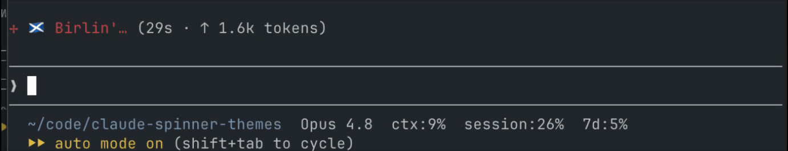
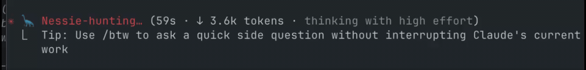
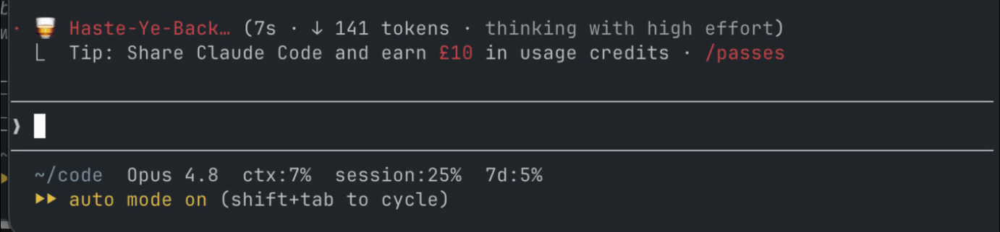

# claude-spinner-themes 🦄🏴󠁧󠁢󠁳󠁣󠁴󠁿

> **Meet Scottish Claude** — Claude Code, but with a bit of home in it.

You know the wee word that flickers while Claude Code is working — *Thinking…*,
*Pondering…*, *Percolating…*? Scottish Claude swaps it for something with a bit
more character:

```
🏴󠁧󠁢󠁳󠁣󠁴󠁿 Swithering…        ⚽ Bicycle-kicking…        🦕 Nessie-hunting…
🦄 Jalousin…           🏰 Up-the-Pars…           🥃 Drammin…
🎶 Painting-the-Forth-Bridge…              🦄 Havering…
```

Six themes, a one-line switch between them, and a wee unicorn (or a rotating
parade of Saltires, castles and Nessie) on every word. It's daft — and weirdly
lovely to watch your editor have a *swither* instead of a think.

<p align="center">
  
</p>

<p align="center"><em>Aye, that says <strong>Birlin'</strong> — Scots for "spinning". The spinner, having a wee birl. We couldn't not.</em></p>

## How it works

Claude Code lets you set your own spinner words through a setting called
`spinnerVerbs`. This repo is just **a set of ready-made Scottish word lists** and
**a wee script that swaps them in and out safely**. No magic, nothing risky — it
only ever changes that one setting.

## The themes

| Theme | A taste of it |
|---|---|
| 🦄 **scottish-words** | Real dictionary Scottish words for thinking and faffing — *Swithering, Jalousin', Dwammin', Dreich, Howkin'* |
| 🏰 **fife** | Fife & Dunfermline patter and heritage — *Slaisterin', Bunkerin', Carnegie-ing, Up-the-Pars* |
| ⚽ **scottish-football** | Legends and the modern lot — *Gemmilling, McCoisting, Fergie-ing, McTominaying, Ya beauty* |
| 🎶 **scottish-culture** | Songs, films, food, sayings, landmarks — *Walkin'-500-Miles, Deep-frying, Painting-the-Forth-Bridge* |
| 🎬 **famous-scots** | Comedy, telly, music — *Big-Yin-ing, Connery-ing, Still-Gaming, Rab-C-ing* |
| 🏴󠁧󠁢󠁳󠁣󠁴󠁿 **the-full-haggis** | The lot, mixed. 160 words of glorious chaos. |

Every word, with its meaning and where it's verified, lives in
**[reference.md](reference.md)** — handy when someone asks "what on earth does
*plowterin'* mean?"

## Get it going (about two minutes)

You'll need [`jq`](https://jqlang.github.io/jq/) — if you haven't got it,
`brew install jq`.

```sh
# 1. grab the repo
git clone https://github.com/cla1redonald/claude-spinner-themes.git
cd claude-spinner-themes

# 2. (optional) make the switcher available from anywhere
ln -s "$PWD/bin/spinner-theme" /opt/homebrew/bin/spinner-theme   # Apple Silicon
# or /usr/local/bin/spinner-theme on Intel Macs

# 3. pick a theme
spinner-theme set the-full-haggis --emoji-rotate

# 4. restart Claude Code — and away you go
```

That's it. The change lands in your `~/.claude/settings.json`; a restart (or a
new session) and it shows up.

## Living with it

```sh
spinner-theme list                  # see every theme; the active one has a *
spinner-theme set fife              # switch theme (plain words)
spinner-theme set fife --emoji      # …with that theme's wee emoji
spinner-theme set fife --emoji-rotate   # …with a rotating Scottish set
spinner-theme current               # what's on right now?
spinner-theme mode append           # mix your words INTO Claude's normal ones
spinner-theme off                   # back to plain old "Thinking…"
spinner-theme restore               # undo the last change
```

## A bit of sparkle ✨

The words are just text, so you can dress them up with emoji:

- `--emoji` puts one wee picture on every word (🦄 by default).
- `--emoji-rotate` **cycles a set** so it changes as Claude thinks — the default
  is 🏴󠁧󠁢󠁳󠁣󠁴󠁿 🦄 🦕 🏰 ⚽ 🥃 🎶 (flag, unicorn, Nessie, castle, football, whisky,
  bagpipes). Want your own? `spinner-theme set fife --emoji-rotate 🏴󠁧󠁢󠁳󠁣󠁴󠁿 🦄 🦕`.

<p align="center">
  
</p>

<p align="center"><em>🦕 <strong>Nessie-hunting…</strong> — the rotating emoji landing on the closest thing Unicode has to a monster of the loch.</em></p>

Two honest notes: there's **no thistle emoji** (Unicode has let Scotland down
there), and the **Scotland flag** 🏴󠁧󠁢󠁳󠁣󠁴󠁿 doesn't render in every terminal —
some show a plain black flag or empty boxes. Check yours with
`printf '%s\n' "🏴󠁧󠁢󠁳󠁣󠁴󠁿"`; if it's a Saltire, you're golden.

## Will it break anything? (No.)

The switcher is careful by design. It **only ever touches the `spinnerVerbs`
key** — everything else in your settings is left exactly as it was (it edits with
`jq`, never a clumsy find-and-replace). Before any change it **makes a backup**
(`settings.json.bak.spinner`), it **checks the result is still valid** before
saving, and `spinner-theme restore` puts it straight back. Want to try it on a
throwaway file first? `CLAUDE_SETTINGS=/tmp/test.json spinner-theme set fife`.

## These aren't made up

The Scottish and Fife words are the real thing. Every mainstream Scottish word was
checked against the **[Dictionaries of the Scots Language](https://dsl.ac.uk)**
(the scholarly national dictionary) or Wiktionary, and the Fife ones come from
local dialect glossaries. The football and culture references got fact-checked
too — which is how a certain midfielder quietly stayed in as a Scotland regular
after it turned out he'd missed the 2026 finals injured. Where a word's spelling
or meaning was shoogly, it was left out rather than invented. The receipts are in
**[reference.md](reference.md)**.

## Make your own

A theme is just a wee JSON file:

```json
{ "mode": "replace", "emoji": "🦄", "verbs": ["Swithering", "Havering", "Dwammin'"] }
```

Drop a new one in `themes/`, and it appears in `spinner-theme list`
automatically. Want it folded into the everything-theme? Rebuild it:

```sh
jq -s '{mode:"replace", emoji:"🦄", verbs:(map(.verbs)|add|unique)}' \
  themes/*.json > themes/the-full-haggis.json
```

**Stuck for ideas?** Scottish is just *my* version — the format goes anywhere,
because it's only words:

- **A Geordie one** 🍺 — *Howay-ing, Gannin', Canny-ing, Wey-aye-ing…*
- **An Aussie one** 🦘 — *Havin'-a-squiz, Chuckin'-a-sickie, She'll-be-right-ing…*
- **Your actual job** — make the spinner talk shop:
  - **QA** 🐛 — *Repro-ing, Flakin', Edge-casing, Regressing, Ship-it-ing…*
  - **Marketing** 📣 — *Ideating, Circling-back, Touching-base, Going-viral…*
  - **Data** 📊 — *Wranglin', Backfilling, Null-handling, Dashboarding…*

Your town, your team, or your trade — whatever raises a smile at 5pm. Fork it and
make it yours.

## Bonus: while you're in your settings

Fancy seeing how much of your session you've used, right in Claude Code's status
line? It's there for the taking — `rate_limits.five_hour.used_percentage` (the
rolling session limit) and `rate_limits.seven_day.used_percentage`. A status line
like `~/code  Fable  ctx:34%  session:61%  7d:12%` is a couple of `jq` lines away.

<p align="center">
  
</p>

<p align="center"><em>🍲 <strong>Haste-Ye-Back…</strong> — "come back soon." A fine thing for your editor to say while it works.</em></p>

## Licence

MIT — see [LICENSE](LICENSE). Use it, fork it, make a Geordie one. Wha's like us? 🏴󠁧󠁢󠁳󠁣󠁴󠁿
